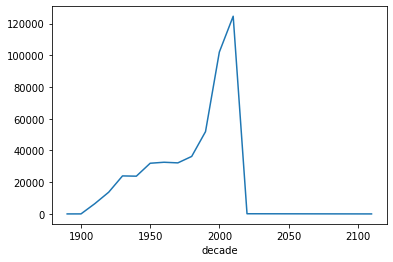

# Mini-Project: Data Wrangling and Transformation with Pandas

Working with tabular data is a necessity for anyone with enterprises having a majority of their data in relational databases and flat files. This mini-project is adopted from the excellent tutorial on pandas by Brandon Rhodes which you have watched earlier in the Data Wrangling Unit. In this mini-project, we will be looking at some interesting data based on movie data from the IMDB.

This assignment should help you reinforce the concepts you learnt in the curriculum for Data Wrangling and sharpen your skills in using Pandas. Good Luck!

### Please make sure you have one of the more recent versions of Pandas


```python
import pandas as pd
import matplotlib.pyplot as plt

%matplotlib inline
```


```python
pd.__version__
```


    '1.0.1'


## Taking a look at the Movies dataset
This data shows the movies based on their title and the year of release


```python
movies = pd.read_csv('titles.csv')
movies.info()
```

    <class 'pandas.core.frame.DataFrame'>
    RangeIndex: 244914 entries, 0 to 244913
    Data columns (total 2 columns):
     #   Column  Non-Null Count   Dtype 
    ---  ------  --------------   ----- 
     0   title   244914 non-null  object
     1   year    244914 non-null  int64 
    dtypes: int64(1), object(1)
    memory usage: 3.7+ MB


```python
movies.head()
```


<div>
<style scoped>
    .dataframe tbody tr th:only-of-type {
        vertical-align: middle;
    }

    .dataframe tbody tr th {
        vertical-align: top;
    }

    .dataframe thead th {
        text-align: right;
    }
</style>
<table border="1" class="dataframe">
  <thead>
    <tr style="text-align: right;">
      <th></th>
      <th>title</th>
      <th>year</th>
    </tr>
  </thead>
  <tbody>
    <tr>
      <th>0</th>
      <td>The Ticket to the Life</td>
      <td>2009</td>
    </tr>
    <tr>
      <th>1</th>
      <td>Parallel Worlds: A New Rock Music Experience</td>
      <td>2016</td>
    </tr>
    <tr>
      <th>2</th>
      <td>Morita - La hija de Jesus</td>
      <td>2008</td>
    </tr>
    <tr>
      <th>3</th>
      <td>Gun</td>
      <td>2017</td>
    </tr>
    <tr>
      <th>4</th>
      <td>Love or Nothing at All</td>
      <td>2014</td>
    </tr>
  </tbody>
</table>
</div>


## Taking a look at the Cast dataset

This data shows the cast (actors, actresses, supporting roles) for each movie

- The attribute `n` basically tells the importance of the cast role, lower the number, more important the role.
- Supporting cast usually don't have any value for `n`


```python
cast = pd.read_csv('cast.csv')
cast.info()
```

    <class 'pandas.core.frame.DataFrame'>
    RangeIndex: 3786176 entries, 0 to 3786175
    Data columns (total 6 columns):
     #   Column     Dtype  
    ---  ------     -----  
     0   title      object 
     1   year       int64  
     2   name       object 
     3   type       object 
     4   character  object 
     5   n          float64
    dtypes: float64(1), int64(1), object(4)
    memory usage: 173.3+ MB


```python
cast.head(10)
```


<div>
<style scoped>
    .dataframe tbody tr th:only-of-type {
        vertical-align: middle;
    }

    .dataframe tbody tr th {
        vertical-align: top;
    }

    .dataframe thead th {
        text-align: right;
    }
</style>
<table border="1" class="dataframe">
  <thead>
    <tr style="text-align: right;">
      <th></th>
      <th>title</th>
      <th>year</th>
      <th>name</th>
      <th>type</th>
      <th>character</th>
      <th>n</th>
    </tr>
  </thead>
  <tbody>
    <tr>
      <th>0</th>
      <td>Closet Monster</td>
      <td>2015</td>
      <td>Buffy #1</td>
      <td>actor</td>
      <td>Buffy 4</td>
      <td>31.0</td>
    </tr>
    <tr>
      <th>1</th>
      <td>Suuri illusioni</td>
      <td>1985</td>
      <td>Homo $</td>
      <td>actor</td>
      <td>Guests</td>
      <td>22.0</td>
    </tr>
    <tr>
      <th>2</th>
      <td>Battle of the Sexes</td>
      <td>2017</td>
      <td>$hutter</td>
      <td>actor</td>
      <td>Bobby Riggs Fan</td>
      <td>10.0</td>
    </tr>
    <tr>
      <th>3</th>
      <td>Secret in Their Eyes</td>
      <td>2015</td>
      <td>$hutter</td>
      <td>actor</td>
      <td>2002 Dodger Fan</td>
      <td>NaN</td>
    </tr>
    <tr>
      <th>4</th>
      <td>Steve Jobs</td>
      <td>2015</td>
      <td>$hutter</td>
      <td>actor</td>
      <td>1988 Opera House Patron</td>
      <td>NaN</td>
    </tr>
    <tr>
      <th>5</th>
      <td>Straight Outta Compton</td>
      <td>2015</td>
      <td>$hutter</td>
      <td>actor</td>
      <td>Club Patron</td>
      <td>NaN</td>
    </tr>
    <tr>
      <th>6</th>
      <td>Straight Outta Compton</td>
      <td>2015</td>
      <td>$hutter</td>
      <td>actor</td>
      <td>Dopeman</td>
      <td>NaN</td>
    </tr>
    <tr>
      <th>7</th>
      <td>For Thy Love 2</td>
      <td>2009</td>
      <td>Bee Moe $lim</td>
      <td>actor</td>
      <td>Thug 1</td>
      <td>NaN</td>
    </tr>
    <tr>
      <th>8</th>
      <td>Lapis, Ballpen at Diploma, a True to Life Journey</td>
      <td>2014</td>
      <td>Jori ' Danilo' Jurado Jr.</td>
      <td>actor</td>
      <td>Jaime (young)</td>
      <td>9.0</td>
    </tr>
    <tr>
      <th>9</th>
      <td>Desire (III)</td>
      <td>2014</td>
      <td>Syaiful 'Ariffin</td>
      <td>actor</td>
      <td>Actor Playing Eteocles from 'Antigone'</td>
      <td>NaN</td>
    </tr>
  </tbody>
</table>
</div>


## Taking a look at the Release dataset

This data shows details of when each movie was release in each country with the release date


```python
release_dates = pd.read_csv('release_dates.csv', parse_dates=['date'], infer_datetime_format=True)
release_dates.info()
```

    <class 'pandas.core.frame.DataFrame'>
    RangeIndex: 479488 entries, 0 to 479487
    Data columns (total 4 columns):
     #   Column   Non-Null Count   Dtype         
    ---  ------   --------------   -----         
     0   title    479488 non-null  object        
     1   year     479488 non-null  int64         
     2   country  479488 non-null  object        
     3   date     479488 non-null  datetime64[ns]
    dtypes: datetime64[ns](1), int64(1), object(2)
    memory usage: 14.6+ MB


```python
release_dates.head()
```


<div>
<style scoped>
    .dataframe tbody tr th:only-of-type {
        vertical-align: middle;
    }

    .dataframe tbody tr th {
        vertical-align: top;
    }

    .dataframe thead th {
        text-align: right;
    }
</style>
<table border="1" class="dataframe">
  <thead>
    <tr style="text-align: right;">
      <th></th>
      <th>title</th>
      <th>year</th>
      <th>country</th>
      <th>date</th>
    </tr>
  </thead>
  <tbody>
    <tr>
      <th>0</th>
      <td>#73, Shaanthi Nivaasa</td>
      <td>2007</td>
      <td>India</td>
      <td>2007-06-15</td>
    </tr>
    <tr>
      <th>1</th>
      <td>#BKKY</td>
      <td>2016</td>
      <td>Cambodia</td>
      <td>2017-10-12</td>
    </tr>
    <tr>
      <th>2</th>
      <td>#Beings</td>
      <td>2015</td>
      <td>Romania</td>
      <td>2015-01-29</td>
    </tr>
    <tr>
      <th>3</th>
      <td>#Captured</td>
      <td>2017</td>
      <td>USA</td>
      <td>2017-09-05</td>
    </tr>
    <tr>
      <th>4</th>
      <td>#Ewankosau saranghaeyo</td>
      <td>2015</td>
      <td>Philippines</td>
      <td>2015-01-21</td>
    </tr>
  </tbody>
</table>
</div>


# Section I - Basic Querying, Filtering and Transformations

### What is the total number of movies?


```python
len(movies)
```


    244914


### List all Batman movies ever made


```python
batman_df = movies[movies.title == 'Batman']
print('Total Batman Movies:', len(batman_df))
batman_df
```

    Total Batman Movies: 2


<div>
<style scoped>
    .dataframe tbody tr th:only-of-type {
        vertical-align: middle;
    }

    .dataframe tbody tr th {
        vertical-align: top;
    }

    .dataframe thead th {
        text-align: right;
    }
</style>
<table border="1" class="dataframe">
  <thead>
    <tr style="text-align: right;">
      <th></th>
      <th>title</th>
      <th>year</th>
    </tr>
  </thead>
  <tbody>
    <tr>
      <th>52734</th>
      <td>Batman</td>
      <td>1943</td>
    </tr>
    <tr>
      <th>150621</th>
      <td>Batman</td>
      <td>1989</td>
    </tr>
  </tbody>
</table>
</div>


### List all Batman movies ever made - the right approach


```python
batman_df = movies[movies.title.str.contains('Batman', case=False)]
print('Total Batman Movies:', len(batman_df))
batman_df.head(10)
```

    Total Batman Movies: 35


<div>
<style scoped>
    .dataframe tbody tr th:only-of-type {
        vertical-align: middle;
    }

    .dataframe tbody tr th {
        vertical-align: top;
    }

    .dataframe thead th {
        text-align: right;
    }
</style>
<table border="1" class="dataframe">
  <thead>
    <tr style="text-align: right;">
      <th></th>
      <th>title</th>
      <th>year</th>
    </tr>
  </thead>
  <tbody>
    <tr>
      <th>16813</th>
      <td>Batman: Anarchy</td>
      <td>2016</td>
    </tr>
    <tr>
      <th>30236</th>
      <td>Batman Forever</td>
      <td>1995</td>
    </tr>
    <tr>
      <th>31674</th>
      <td>Batman Untold</td>
      <td>2010</td>
    </tr>
    <tr>
      <th>31711</th>
      <td>Scooby-Doo &amp; Batman: the Brave and the Bold</td>
      <td>2018</td>
    </tr>
    <tr>
      <th>41881</th>
      <td>Batman the Rise of Red Hood</td>
      <td>2018</td>
    </tr>
    <tr>
      <th>43484</th>
      <td>Batman: Return of the Caped Crusaders</td>
      <td>2016</td>
    </tr>
    <tr>
      <th>46333</th>
      <td>Batman &amp; Robin</td>
      <td>1997</td>
    </tr>
    <tr>
      <th>51811</th>
      <td>Batman Revealed</td>
      <td>2012</td>
    </tr>
    <tr>
      <th>52734</th>
      <td>Batman</td>
      <td>1943</td>
    </tr>
    <tr>
      <th>56029</th>
      <td>Batman Beyond: Rising Knight</td>
      <td>2014</td>
    </tr>
  </tbody>
</table>
</div>


### Display the top 15 Batman movies in the order they were released


```python
batman_df.sort_values(by=['year'], ascending=True).iloc[:15]
```


<div>
<style scoped>
    .dataframe tbody tr th:only-of-type {
        vertical-align: middle;
    }

    .dataframe tbody tr th {
        vertical-align: top;
    }

    .dataframe thead th {
        text-align: right;
    }
</style>
<table border="1" class="dataframe">
  <thead>
    <tr style="text-align: right;">
      <th></th>
      <th>title</th>
      <th>year</th>
    </tr>
  </thead>
  <tbody>
    <tr>
      <th>52734</th>
      <td>Batman</td>
      <td>1943</td>
    </tr>
    <tr>
      <th>100056</th>
      <td>Batman and Robin</td>
      <td>1949</td>
    </tr>
    <tr>
      <th>161439</th>
      <td>Batman Dracula</td>
      <td>1964</td>
    </tr>
    <tr>
      <th>84327</th>
      <td>Alyas Batman at Robin</td>
      <td>1965</td>
    </tr>
    <tr>
      <th>68364</th>
      <td>James Batman</td>
      <td>1966</td>
    </tr>
    <tr>
      <th>161527</th>
      <td>Batman: The Movie</td>
      <td>1966</td>
    </tr>
    <tr>
      <th>56159</th>
      <td>Batman Fights Dracula</td>
      <td>1967</td>
    </tr>
    <tr>
      <th>168504</th>
      <td>Fight! Batman, Fight!</td>
      <td>1973</td>
    </tr>
    <tr>
      <th>150621</th>
      <td>Batman</td>
      <td>1989</td>
    </tr>
    <tr>
      <th>156239</th>
      <td>Alyas Batman en Robin</td>
      <td>1991</td>
    </tr>
    <tr>
      <th>156755</th>
      <td>Batman Returns</td>
      <td>1992</td>
    </tr>
    <tr>
      <th>63366</th>
      <td>Batman: Mask of the Phantasm</td>
      <td>1993</td>
    </tr>
    <tr>
      <th>30236</th>
      <td>Batman Forever</td>
      <td>1995</td>
    </tr>
    <tr>
      <th>46333</th>
      <td>Batman &amp; Robin</td>
      <td>1997</td>
    </tr>
    <tr>
      <th>208220</th>
      <td>Batman Begins</td>
      <td>2005</td>
    </tr>
  </tbody>
</table>
</div>


### Section I - Q1 : List all the 'Harry Potter' movies from the most recent to the earliest


```python
HrryPotter_df = movies[movies.title.str.contains('Harry Potter', case=False)]
print('Total Harry Potter Movies:', len(HrryPotter_df))
HrryPotter_df.sort_values(by=['year'], ascending=False)
```

    Total Harry Potter Movies: 8


<div>
<style scoped>
    .dataframe tbody tr th:only-of-type {
        vertical-align: middle;
    }

    .dataframe tbody tr th {
        vertical-align: top;
    }

    .dataframe thead th {
        text-align: right;
    }
</style>
<table border="1" class="dataframe">
  <thead>
    <tr style="text-align: right;">
      <th></th>
      <th>title</th>
      <th>year</th>
    </tr>
  </thead>
  <tbody>
    <tr>
      <th>143147</th>
      <td>Harry Potter and the Deathly Hallows: Part 2</td>
      <td>2011</td>
    </tr>
    <tr>
      <th>152831</th>
      <td>Harry Potter and the Deathly Hallows: Part 1</td>
      <td>2010</td>
    </tr>
    <tr>
      <th>109213</th>
      <td>Harry Potter and the Half-Blood Prince</td>
      <td>2009</td>
    </tr>
    <tr>
      <th>50581</th>
      <td>Harry Potter and the Order of the Phoenix</td>
      <td>2007</td>
    </tr>
    <tr>
      <th>187926</th>
      <td>Harry Potter and the Goblet of Fire</td>
      <td>2005</td>
    </tr>
    <tr>
      <th>61957</th>
      <td>Harry Potter and the Prisoner of Azkaban</td>
      <td>2004</td>
    </tr>
    <tr>
      <th>82791</th>
      <td>Harry Potter and the Chamber of Secrets</td>
      <td>2002</td>
    </tr>
    <tr>
      <th>223087</th>
      <td>Harry Potter and the Sorcerer's Stone</td>
      <td>2001</td>
    </tr>
  </tbody>
</table>
</div>


### How many movies were made in the year 2017?


```python
len(movies[movies.year == 2017])
```


    11474


### Section I - Q2 : How many movies were made in the year 2015?


```python
len(movies[movies.year == 2015])
```


    8702


### Section I - Q3 : How many movies were made from 2000 till 2018?
- You can chain multiple conditions using OR (`|`) as well as AND (`&`) depending on the condition


```python
len(movies[(movies.year >2008) | (movies.year <2018)])
```


    244914


### Section I - Q4: How many movies are titled "Hamlet"?


```python
len(movies[movies.title == 'Hamlet'])
```


    20


### Section I - Q5: List all movies titled "Hamlet" 
- The movies should only have been released on or after the year 2000
- Display the movies based on the year they were released (earliest to most recent)


```python
movies[movies.title == 'Hamlet']
```


<div>
<style scoped>
    .dataframe tbody tr th:only-of-type {
        vertical-align: middle;
    }

    .dataframe tbody tr th {
        vertical-align: top;
    }

    .dataframe thead th {
        text-align: right;
    }
</style>
<table border="1" class="dataframe">
  <thead>
    <tr style="text-align: right;">
      <th></th>
      <th>title</th>
      <th>year</th>
    </tr>
  </thead>
  <tbody>
    <tr>
      <th>1931</th>
      <td>Hamlet</td>
      <td>2009</td>
    </tr>
    <tr>
      <th>8214</th>
      <td>Hamlet</td>
      <td>1976</td>
    </tr>
    <tr>
      <th>46344</th>
      <td>Hamlet</td>
      <td>1921</td>
    </tr>
    <tr>
      <th>55639</th>
      <td>Hamlet</td>
      <td>2000</td>
    </tr>
    <tr>
      <th>73869</th>
      <td>Hamlet</td>
      <td>1948</td>
    </tr>
    <tr>
      <th>98326</th>
      <td>Hamlet</td>
      <td>1990</td>
    </tr>
    <tr>
      <th>118535</th>
      <td>Hamlet</td>
      <td>1913</td>
    </tr>
    <tr>
      <th>124506</th>
      <td>Hamlet</td>
      <td>1911</td>
    </tr>
    <tr>
      <th>140203</th>
      <td>Hamlet</td>
      <td>1954</td>
    </tr>
    <tr>
      <th>155004</th>
      <td>Hamlet</td>
      <td>1964</td>
    </tr>
    <tr>
      <th>178290</th>
      <td>Hamlet</td>
      <td>2014</td>
    </tr>
    <tr>
      <th>180979</th>
      <td>Hamlet</td>
      <td>1987</td>
    </tr>
    <tr>
      <th>181090</th>
      <td>Hamlet</td>
      <td>1910</td>
    </tr>
    <tr>
      <th>186137</th>
      <td>Hamlet</td>
      <td>2015</td>
    </tr>
    <tr>
      <th>191940</th>
      <td>Hamlet</td>
      <td>2016</td>
    </tr>
    <tr>
      <th>218339</th>
      <td>Hamlet</td>
      <td>1973</td>
    </tr>
    <tr>
      <th>222156</th>
      <td>Hamlet</td>
      <td>1969</td>
    </tr>
    <tr>
      <th>227953</th>
      <td>Hamlet</td>
      <td>2011</td>
    </tr>
    <tr>
      <th>241149</th>
      <td>Hamlet</td>
      <td>1996</td>
    </tr>
    <tr>
      <th>244747</th>
      <td>Hamlet</td>
      <td>2017</td>
    </tr>
  </tbody>
</table>
</div>


### Section I - Q6: How many roles in the movie "Inception" are of the supporting cast (extra credits)
- supporting cast are NOT ranked by an "n" value (NaN)
- check for how to filter based on nulls


```python
inception_df = cast[cast.title == "Inception"]
supporting_cast = inception_df[inception_df.n.isna()]

len(supporting_cast)
```


    27


### Section I - Q7: How many roles in the movie "Inception" are of the main cast
- main cast always have an 'n' value


```python
main_cast = inception_df[inception_df.n.notna()]

len(main_cast)

```


    51


### Section I - Q8: Show the top ten cast (actors\actresses) in the movie "Inception" 
- main cast always have an 'n' value
- remember to sort!


```python
inception_df =  cast[cast.title == "Inception"]
main_cast = inception_df[inception_df.n.notna()].sort_values(by=['n'], ascending=True)

main_cast.name[:10]
```


    590576        Leonardo DiCaprio
    859993     Joseph Gordon-Levitt
    3387147              Ellen Page
    940923                Tom Hardy
    2406531            Ken Watanabe
    1876301              Dileep Rao
    1615709          Cillian Murphy
    183937             Tom Berenger
    2765969        Marion Cotillard
    1826027      Pete Postlethwaite
    Name: name, dtype: object


### Section I - Q9:

(A) List all movies where there was a character 'Albus Dumbledore' 

(B) Now modify the above to show only the actors who played the character 'Albus Dumbledore'
- For Part (B) remember the same actor might play the same role in multiple movies


```python
# A
cast_albus = cast[cast.character.str.contains("Albus Dumbledore", case=False)]

Title_albus = cast_albus.title
print("A: all movies where there was a cahracter \'Albus Dumbledore\'")
print(Title_albus)

```

    A: all movies where there was a cahracter 'Albus Dumbledore'
    704984                                       Epic Movie
    792419     Harry Potter and the Deathly Hallows: Part 1
    792420     Harry Potter and the Deathly Hallows: Part 2
    792421              Harry Potter and the Goblet of Fire
    792422           Harry Potter and the Half-Blood Prince
    792423        Harry Potter and the Order of the Phoenix
    792424         Harry Potter and the Prisoner of Azkaban
    947789          Harry Potter and the Chamber of Secrets
    947790            Harry Potter and the Sorcerer's Stone
    1685537                           Ultimate Hero Project
    1893421    Harry Potter and the Deathly Hallows: Part 1
    2248085                                          Potter
    Name: title, dtype: object


```python
# B
actor_albus = cast_albus.name
print("B: the list of actors who played the cahracter \'Albus Dumbledore\'")
print(actor_albus.unique())
```

    B: the list of actors who played the cahracter 'Albus Dumbledore'
    ['Dane Farwell' 'Michael Gambon' 'Richard Harris' "George (X) O'Connor"
     'Toby Regbo' 'Timothy Tedmanson']


### Section I - Q10:

(A) How many roles has 'Keanu Reeves' played throughout his career?

(B) List the leading roles that 'Keanu Reeves' played on or after 1999 in order by year.


```python
len(cast[cast.name.str.contains("Keanu Reeves", case=False)].character.unique())
```


    56


```python
KR_df = cast[cast.name.str.contains("Keanu Reeves", case=False)]

KR_lead_df = KR_df[(KR_df.n==1) & (KR_df.year >= 1999)].sort_values(by=['year'], ascending=True)

print("the leading roles that 'Keanu Reeves' played on or after 1999 in order by year")
KR_lead_df.character
```

    the leading roles that 'Keanu Reeves' played on or after 1999 in order by year


    1892390                     Neo
    1892397             Shane Falco
    1892358           Conor O'Neill
    1892383             Nelson Moss
    1892348        John Constantine
    1892388              Alex Wyler
    1892382    Detective Tom Ludlow
    1892385                  Klaatu
    1892359             Henry Torne
    1892342                     Kai
    1892361               John Wick
    1892366                    Evan
    1892399                  Ramsey
    1892362               John Wick
    1892378              Lucas Hill
    Name: character, dtype: object


### Section I - Q11: 

(A) List the total number of actor and actress roles available from 1950 - 1960

(B) List the total number of actor and actress roles available from 2007 - 2017


```python
import numpy as np
[(year, len(cast[cast.year==year])) for year in np.arange(1950,1961)]
```


    [(1950, 22397),
     (1951, 23539),
     (1952, 23216),
     (1953, 22809),
     (1954, 19289),
     (1955, 20721),
     (1956, 22345),
     (1957, 21510),
     (1958, 20345),
     (1959, 19300),
     (1960, 19164)]


```python
cast[(cast.year>=1950) & (cast.year<=1960)].groupby(cast.year).agg("count")["character"]
```


    year
    1950    22397
    1951    23539
    1952    23216
    1953    22809
    1954    19289
    1955    20721
    1956    22345
    1957    21510
    1958    20345
    1959    19300
    1960    19164
    Name: character, dtype: int64


```python
import numpy as np
# [(year, len(cast[cast.year==year])) for year in np.arange(2007,2018)]

cast[(cast.year>=2007) & (cast.year<=2017)].groupby(cast.year).agg("count")["character"]
```


    year
    2007     90309
    2008    100194
    2009    118709
    2010    115119
    2011    127658
    2012    135950
    2013    142421
    2014    151007
    2015    152474
    2016    159132
    2017    159440
    Name: character, dtype: int64


### Section I - Q12: 

(A) List the total number of leading roles available from 2000 to present

(B) List the total number of non-leading roles available from 2000 - present (exclude support cast)

(C) List the total number of support\extra-credit roles available from 2000 - present


```python
cast[(cast.n==1) & (cast.year >= 2000)].groupby(cast.year).agg("count").rename(columns={"character": "leading_roles"})["leading_roles"]
```


    year
    2000    2033
    2001    2095
    2002    2213
    2003    2202
    2004    2391
    2005    2623
    2006    2882
    2007    2964
    2008    3256
    2009    3685
    2010    3624
    2011    4076
    2012    4153
    2013    4303
    2014    4399
    2015    4386
    2016    4346
    2017    3938
    2018     967
    2019      28
    2020       4
    Name: leading_roles, dtype: int64


```python
# df = cast[(cast.n==1) & (cast.year >= 2000)]

# print("A) year #leading_roles")
# for group in df.groupby(df.year):
#     year = group[0]
#     roleNumber = len(group[1])
#     print(year, roleNumber)
```


```python
cast[(cast.n>1) & (cast.year >= 2000)].groupby(cast.year).agg("count").rename(columns={"character": "non-leading_roles"})["non-leading_roles"]

# df = cast[(cast.n > 1) & (cast.year >= 2000)]

# print("B) year #non-leading_roles")
# for group in df.groupby(df.year):
#     year = group[0]
#     roleNumber = len(group[1])
#     print(year, roleNumber)
```


    year
    2000    37247
    2001    39172
    2002    39952
    2003    40546
    2004    42102
    2005    47110
    2006    52215
    2007    52750
    2008    56606
    2009    63803
    2010    60163
    2011    67628
    2012    69565
    2013    70371
    2014    70393
    2015    67809
    2016    63923
    2017    50222
    2018     9942
    2019      187
    2020        4
    Name: non-leading_roles, dtype: int64


```python
cast[(cast.n.isna()) & (cast.year >= 2000)].groupby(cast.year).agg("count").rename(columns={"character": "support_roles"})["support_roles"]

# df = cast[(cast.n.isna()) & (cast.year >= 2000)]

# print("C) year #support_roles")
# for group in df.groupby(df.year):
#     year = group[0]
#     roleNumber = len(group[1])
#     print(year, roleNumber)
```


    year
    2000     11997
    2001     12431
    2002     13122
    2003     15143
    2004     20111
    2005     25698
    2006     30912
    2007     34595
    2008     40332
    2009     51221
    2010     51332
    2011     55954
    2012     62232
    2013     67747
    2014     76215
    2015     80279
    2016     90863
    2017    105280
    2018     40395
    2019      1363
    2020       182
    2021        35
    2022        16
    2023         2
    2024        15
    2025         9
    2115         3
    Name: support_roles, dtype: int64


# Section II - Aggregations, Transformations and Visualizations

## What are the top ten most common movie names of all time?


```python
top_ten = movies.title.value_counts()[:10]
top_ten
```


    Hamlet                  20
    Carmen                  17
    Macbeth                 16
    Maya                    12
    The Outsider            12
    Temptation              12
    Honeymoon               11
    Freedom                 11
    Othello                 11
    The Three Musketeers    11
    Name: title, dtype: int64


### Plot the top ten common movie names of all time


```python
top_ten.plot(kind='barh')
```


    <matplotlib.axes._subplots.AxesSubplot at 0x7f8214bf5550>


### Section II - Q1:  Which years in the 2000s saw the most movies released? (Show top 3)
release_dates.head()

R2000 = release_dates[release_dates.year >= 2000]

top_3r = R2000.year.value_counts()[:3]
top_3r
### Section II - Q2: # Plot the total number of films released per-decade (1890, 1900, 1910,....)
- Hint: Dividing the year and multiplying with a number might give you the decade the year falls into!
- You might need to sort before plotting


```python
df = release_dates[["year", "date"]]
df["decade"] = df.year-df.year%10

decades = df.groupby('decade').agg([np.mean, np.std, 'count'])
decades.year["count"].plot()
```

    /opt/conda/envs/springboard/lib/python3.7/site-packages/ipykernel_launcher.py:2: SettingWithCopyWarning: 
    A value is trying to be set on a copy of a slice from a DataFrame.
    Try using .loc[row_indexer,col_indexer] = value instead
    
    See the caveats in the documentation: https://pandas.pydata.org/pandas-docs/stable/user_guide/indexing.html#returning-a-view-versus-a-copy
      


    <matplotlib.axes._subplots.AxesSubplot at 0x7f8216f29990>





### Section II - Q3: 

(A) What are the top 10 most common character names in movie history?

(B) Who are the top 10 people most often credited as "Herself" in movie history?

(C) Who are the top 10 people most often credited as "Himself" in movie history?


```python
top_ten = cast.character.value_counts()[:10]
top_ten
```


    Himself        20746
    Dancer         12477
    Extra          11948
    Reporter        8434
    Student         7773
    Doctor          7669
    Party Guest     7245
    Policeman       7029
    Nurse           6999
    Bartender       6802
    Name: character, dtype: int64


```python
top_ten = cast[cast.character=="Herself"].name.value_counts()[:10]
top_ten
```


    Queen Elizabeth II        12
    Mar?a Luisa (V) Mart?n     9
    Joyce Brothers             9
    Luisa Horga                9
    Margaret Thatcher          8
    Hillary Clinton            8
    Rekha                      6
    Joan Rivers                6
    Oprah Winfrey              6
    Sumie Sakai                6
    Name: name, dtype: int64


```python
top_ten = cast[cast.character=="Himself"].name.value_counts()[:10]
top_ten
```


    Adolf Hitler          99
    Richard Nixon         44
    Ronald Reagan         41
    John F. Kennedy       37
    George W. Bush        25
    Winston Churchill     24
    Martin Luther King    23
    Ron Jeremy            22
    Bill Clinton          22
    Benito Mussolini      21
    Name: name, dtype: int64


### Section II - Q4: 

(A) What are the top 10 most frequent roles that start with the word "Zombie"?

(B) What are the top 10 most frequent roles that start with the word "Police"?

- Hint: The `startswith()` function might be useful


```python
top_ten = cast[cast.character.str.startswith("Zombie")].character.value_counts()[:10]
top_ten
```


    Zombie                         6264
    Zombie Horde                    206
    Zombie - Protestor - Victim      78
    Zombie Extra                     70
    Zombie Dancer                    43
    Zombie #1                        36
    Zombie Girl                      36
    Zombie #2                        31
    Zombie Vampire                   25
    Zombie Victim                    22
    Name: character, dtype: int64


```python
top_ten = cast[cast.character.str.startswith("Police")].character.value_counts()[:10]
top_ten
```


    Policeman              7029
    Police Officer         4808
    Police Inspector        742
    Police Sergeant         674
    Police officer          539
    Police                  456
    Policewoman             415
    Police Chief            410
    Police Captain          387
    Police Commissioner     337
    Name: character, dtype: int64


### Section II - Q5: Plot how many roles 'Keanu Reeves' has played in each year of his career.


```python
KR_df = cast[cast.name.str.contains("Keanu Reeves", case=False)]

KR_df.groupby('year').agg('count')["character"].plot()

```


    <matplotlib.axes._subplots.AxesSubplot at 0x7f8216edad50>


### Section II - Q6: Plot the cast positions (n-values) of Keanu Reeve's roles through his career over the years.


```python
KR_df = cast[cast.name.str.contains("Keanu Reeves", case=False)]

print("The average of Keanu Reeve's role rankes through his career over the years")
KR_df.groupby('year').agg('mean')["n"].plot()
```

    The average of Keanu Reeve's role rankes through his career over the years


    <matplotlib.axes._subplots.AxesSubplot at 0x7f8216b3cf90>


### Section II - Q7: Plot the number of "Hamlet" films made by each decade


```python
df = cast[cast.title == "Hamlet"]
df["decade"] = df.year-df.year%10

decades = df.groupby('decade').agg(['count'])
decades.year["count"].plot()
```

    /opt/conda/envs/springboard/lib/python3.7/site-packages/ipykernel_launcher.py:2: SettingWithCopyWarning: 
    A value is trying to be set on a copy of a slice from a DataFrame.
    Try using .loc[row_indexer,col_indexer] = value instead
    
    See the caveats in the documentation: https://pandas.pydata.org/pandas-docs/stable/user_guide/indexing.html#returning-a-view-versus-a-copy
      


    <matplotlib.axes._subplots.AxesSubplot at 0x7f8216aaeed0>


### Section II - Q8: 

(A) How many leading roles were available to both actors and actresses, in the 1960s (1960-1969)?

(B) How many leading roles were available to both actors and actresses, in the 2000s (2000-2009)?

- Hint: A specific value of n might indicate a leading role


```python
lead_actor = cast[(cast.n==1) & (cast.type=="actor") & (cast.year>=1960) & (cast.year<1970)]
lead_actress = cast[(cast.n==1) & (cast.type=="actress") & (cast.year>=1960) & (cast.year<1970)]

print("No. leading actors (1960s): ", len(lead_actor))
print("No. leading actresses (1960s): ", len(lead_actress))
```

    No. leading actors (1960s):  8320
    No. leading actresses (1960s):  3503


```python
lead_actor = cast[(cast.n==1) & (cast.type=="actor") & (cast.year>=2000) & (cast.year<2010)]
lead_actress = cast[(cast.n==1) & (cast.type=="actress") & (cast.year>=2000) & (cast.year<2010)]

print("No. leading actors (2000s): ", len(lead_actor))
print("No. leading actresses (2000s): ", len(lead_actress))
```

    No. leading actors (2000s):  18557
    No. leading actresses (2000s):  7787


### Section II - Q9: List, in order by year, each of the films in which Frank Oz has played more than 1 role.


```python
title_grp = cast[cast.name == 'Frank Oz'].groupby(['title'])

# a list of tuples (year, number of roles, film title)
year_no_title = [(gr[1].year.iloc[0], len(gr[1]), gr[0]) for gr in title_grp if len(gr[1])>1]

# sorting the list in terms of the first element, i.e yeat
year_no_title.sort(key = lambda x: x[0])

print("year, # of roles, file title")
year_no_title
```

    year, # of roles, file title


    [(1979, 8, 'The Muppet Movie'),
     (1981, 2, 'An American Werewolf in London'),
     (1981, 6, 'The Great Muppet Caper'),
     (1982, 2, 'The Dark Crystal'),
     (1984, 7, 'The Muppets Take Manhattan'),
     (1985, 3, 'Follow That Bird'),
     (1992, 7, 'The Muppet Christmas Carol'),
     (1996, 4, 'Muppet Treasure Island'),
     (1999, 4, 'Muppets from Space'),
     (1999, 3, 'The Adventures of Elmo in Grouchland')]


### Section II - Q10: List each of the characters that Frank Oz has portrayed at least twice


```python
df = cast[cast.name == 'Frank Oz'].groupby(['character']).agg('count')
df = df[df.title>1].title

print("character, # of appearances")
df
```

    character, # of appearances


    character
    Animal            6
    Bert              3
    Cookie Monster    5
    Fozzie Bear       4
    Grover            2
    Miss Piggy        6
    Sam the Eagle     5
    Yoda              6
    Name: title, dtype: int64


# Section III - Advanced Merging, Querying and Visualizations

## Make a bar plot with the following conditions
- Frequency of the number of movies with "Christmas" in their title 
- Movies should be such that they are released in the USA.
- Show the frequency plot by month


```python
christmas = release_dates[(release_dates.title.str.contains('Christmas')) & (release_dates.country == 'USA')]
christmas.date.dt.month.value_counts().sort_index().plot(kind='bar')
```


    <matplotlib.axes._subplots.AxesSubplot at 0x7f82151d48d0>


### Section III - Q1: Make a bar plot with the following conditions
- Frequency of the number of movies with "Summer" in their title 
- Movies should be such that they are released in the USA.
- Show the frequency plot by month


```python
summers = release_dates[(release_dates.title.str.contains('Summer')) & (release_dates.country == 'USA')]
summers.date.dt.month.value_counts().sort_index().plot(kind='bar')
```


    <matplotlib.axes._subplots.AxesSubplot at 0x7f8214f0ec50>


### Section III - Q2: Make a bar plot with the following conditions
- Frequency of the number of movies with "Action" in their title 
- Movies should be such that they are released in the USA.
- Show the frequency plot by week


```python
actions = release_dates[(release_dates.title.str.contains('Action')) & (release_dates.country == 'USA')]
actions.date.dt.weekday.value_counts().sort_index().plot(kind='bar')
```


    <matplotlib.axes._subplots.AxesSubplot at 0x7f8214e34e50>


### Section III - Q3: Show all the movies in which Keanu Reeves has played the lead role along with their   release date in the USA sorted by the date of release
- Hint: You might need to join or merge two datasets!


```python
KR_df = cast[(cast.name == "Keanu Reeves") & (cast.n==1)]

df_cast_release = pd.merge(KR_df, release_dates, how="inner", on=['title', 'year'])
df_cast_release = df_cast_release[df_cast_release.country == 'USA'].sort_values(by='date')

print("movie, release date")
df_cast_release[["title", "date"]]
```

    movie, release date


<div>
<style scoped>
    .dataframe tbody tr th:only-of-type {
        vertical-align: middle;
    }

    .dataframe tbody tr th {
        vertical-align: top;
    }

    .dataframe thead th {
        text-align: right;
    }
</style>
<table border="1" class="dataframe">
  <thead>
    <tr style="text-align: right;">
      <th></th>
      <th>title</th>
      <th>date</th>
    </tr>
  </thead>
  <tbody>
    <tr>
      <th>714</th>
      <td>The Night Before</td>
      <td>1988-04-15</td>
    </tr>
    <tr>
      <th>78</th>
      <td>Bill &amp; Ted's Excellent Adventure</td>
      <td>1989-02-17</td>
    </tr>
    <tr>
      <th>69</th>
      <td>Bill &amp; Ted's Bogus Journey</td>
      <td>1991-07-19</td>
    </tr>
    <tr>
      <th>433</th>
      <td>Little Buddha</td>
      <td>1994-05-25</td>
    </tr>
    <tr>
      <th>441</th>
      <td>Speed</td>
      <td>1994-06-10</td>
    </tr>
    <tr>
      <th>371</th>
      <td>Johnny Mnemonic</td>
      <td>1995-05-26</td>
    </tr>
    <tr>
      <th>49</th>
      <td>A Walk in the Clouds</td>
      <td>1995-08-11</td>
    </tr>
    <tr>
      <th>91</th>
      <td>Chain Reaction</td>
      <td>1996-08-02</td>
    </tr>
    <tr>
      <th>190</th>
      <td>Feeling Minnesota</td>
      <td>1996-09-13</td>
    </tr>
    <tr>
      <th>593</th>
      <td>The Devil's Advocate</td>
      <td>1997-10-17</td>
    </tr>
    <tr>
      <th>671</th>
      <td>The Matrix</td>
      <td>1999-03-31</td>
    </tr>
    <tr>
      <th>715</th>
      <td>The Replacements</td>
      <td>2000-08-11</td>
    </tr>
    <tr>
      <th>510</th>
      <td>Sweet November</td>
      <td>2001-02-16</td>
    </tr>
    <tr>
      <th>205</th>
      <td>Hard Ball</td>
      <td>2001-09-14</td>
    </tr>
    <tr>
      <th>150</th>
      <td>Constantine</td>
      <td>2005-02-18</td>
    </tr>
    <tr>
      <th>631</th>
      <td>The Lake House</td>
      <td>2006-06-16</td>
    </tr>
    <tr>
      <th>473</th>
      <td>Street Kings</td>
      <td>2008-04-11</td>
    </tr>
    <tr>
      <th>581</th>
      <td>The Day the Earth Stood Still</td>
      <td>2008-12-12</td>
    </tr>
    <tr>
      <th>9</th>
      <td>47 Ronin</td>
      <td>2013-12-25</td>
    </tr>
    <tr>
      <th>248</th>
      <td>John Wick</td>
      <td>2014-10-24</td>
    </tr>
    <tr>
      <th>407</th>
      <td>Knock Knock</td>
      <td>2015-10-09</td>
    </tr>
    <tr>
      <th>325</th>
      <td>John Wick: Chapter 2</td>
      <td>2017-02-10</td>
    </tr>
  </tbody>
</table>
</div>


### Section III - Q4: Make a bar plot showing the months in which movies with Keanu Reeves tend to be released in the USA?


```python
df_cast_release.date.dt.month.value_counts().sort_index().plot(kind='bar')
print("February is the most likely release month for Keanu Reeves.")
```

    February is the most likely release month for Keanu Reeves.


### Section III - Q5: Make a bar plot showing the years in which movies with Ian McKellen tend to be released in the USA?


```python
IM_df = cast[(cast.name == "Ian McKellen") & (cast.n==1)]

df_cast_release = pd.merge(IM_df, release_dates, how="inner", on=['title', 'year'])
df_cast_release = df_cast_release[df_cast_release.country == 'USA'].sort_values(by='date')

df_cast_release.date.dt.month.value_counts().sort_index().plot(kind='bar')
print("December is the most likely release month for Ian McKellen.")
```

    December is the most likely release month for Ian McKellen.


```python

```
